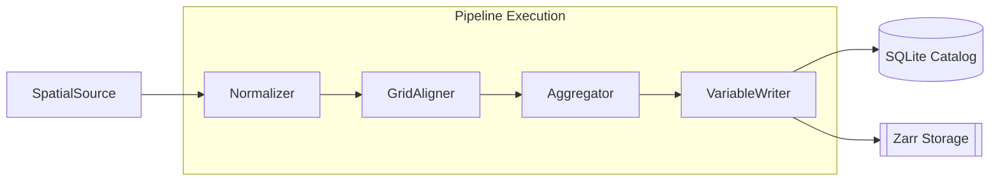
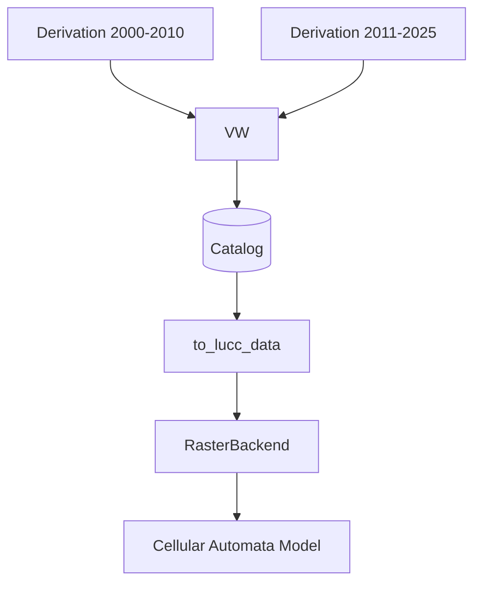
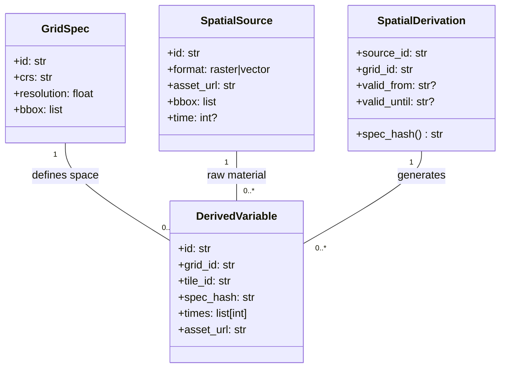

# DisSCube

> **⚠️ Project Status: Early Stage (Alpha)**
> This project is currently in its initial development phase. APIs and data structures are subject to frequent changes as we evolve the core engine.

DisSCube is a high-performance spatial data cube engine designed for land change modeling within the **DisSModel** ecosystem. It provides a bridge between raw geospatial data (Rasters, Vectors, Points) and multidimensional analysis ready for statistical and dynamic models (like TerraME).

## 🚀 Key Features

- **FillCell Operators**: Legacy logic of TerraView FillCell for robust data aggregation.
    - **Raster**: Majority, Mean, Max, Min, and Sum resampling.
    - **Vector**: Presence (Boolean), Count, and area-weighted strategies.
    - **Proximity**: High-performance Euclidean distance transforms.
- **Temporal Backend**: Support for multi-period variables. Derived products can have temporal validity windows, allowing models to load dynamic drivers.
- **Snapped Grids**: Automatic alignment of local grids (e.g., State-level) to national meshes (e.g., BDC 5km) to ensure pixel-perfect interoperability.
- **Master Grid Architecture**: Native support for **Brazil Data Cube (BDC)** master grids (SM, MD, LG) and custom 100m grids with tiled processing.
- **SQLite Catalog**: High-performance, concurrent registry for spatial metadata and variable provenance.
- **Multidimensional Storage**: Uses **Zarr** and **Xarray** for efficient storage of high-resolution spatial variables.

## 🛠 Architecture

DisSCube is built on a decoupled architecture that separates spatial definitions (Grids) from data partitions (Tiles).

### 1. Data Processing Pipeline
The core engine follows a sequential pipeline where each stage transforms the `PipelineContext`.



### 2. Temporal Awareness
Derivations can be associated with a time window. `to_lucc_data` automatically stacks these fatias into a 3D DataArray `(time, y, x)`, allowing CA models to query drivers by year.



### 3. Entity Model
The catalog maintains the relationships between sources, derivations, and the physical assets.



## 📖 Quick Start

### Installation

```bash
# Clone the repository
git clone https://github.com/dissmodel/disscube.git
cd disscube

# Set up environment
python -m venv .venv
source .venv/bin/activate
pip install -r requirements.txt
```

### Basic Usage

```python
from disscube.client import CubeClient
from disscube.models import Variable, SpatialDerivation

# Initialize client (Now using SQLite)
cube = CubeClient(catalog="catalog.db", store="./data/")

# Define a derivation for a specific BDC Tile
derivation = SpatialDerivation(
    source_id="urban_centers",
    grid_id="BDC_100m", # Master Grid
    role="driver",
    variables=[Variable(name="dist_sedes", operator="min_distance")]
)

# Execute pipeline for a specific partition
cube.derive(derivation, tile_id="009002")

# Load data with tile disambiguation
res = cube.load("dist_sedes", tile_id="009002")
print(res.shape)
```

## 📁 Storage Structure

Derived data is stored hierarchically to optimize access and prevent collisions:
`data/derived/{grid_id}/{tile_id}/{spec_hash}/{variable_name}.zarr`

## 🔍 Tools

- `zarr_to_tif.py`: Export any Zarr variable to GeoTIFF for QGIS.
  ```bash
  python tools/zarr_to_tif.py data/derived/.../var.zarr output.tif
  ```
- `inspect_raster.py`: Check CRS and bounds of raw rasters.
- `list_grids.py`: List all master and local grids in the SQLite catalog.

## 📄 License

This project is part of the DisSModel ecosystem. See the LICENSE file for details.
