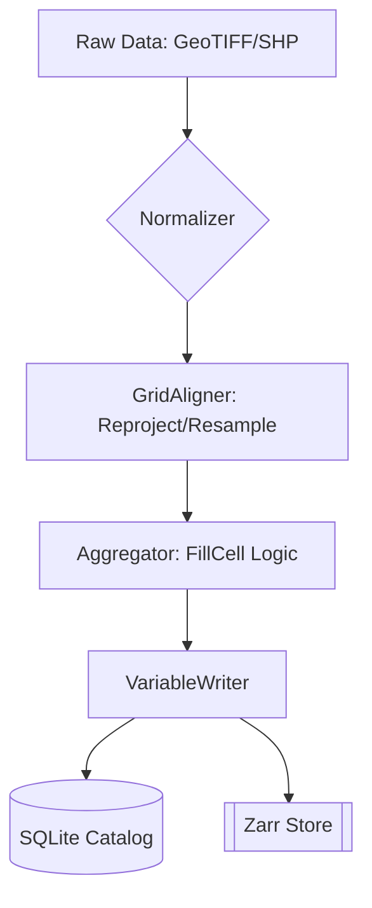

# Architecture Overview

DisSCube is designed as a **Data Cube Engine** specifically optimized for Land Use and Cover Change (LUCC) modeling. Unlike traditional GIS systems that handle files, DisSCube handles **Variables** aligned in space and time.

## Core Design Principles

### 1. Separation of Space and Asset
In traditional workflows, a "Grid" is often tied to a "File". In DisSCube, a `GridSpec` is a mathematical definition of space (CRS + Resolution + Extent). Multiple files (Tiles) can belong to the same Grid.

### 2. Immutability & Provenance
Every operation in DisSCube is tracked via a `spec_hash`. If you change the parameters of a derivation, the hash changes, and a new variable is created. This ensures scientific reproducibility.

### 3. Tiled Execution
To support continental-scale data (like Brazil at 10m), the engine never loads the full grid into memory. It partitions the execution using BDC (Brazil Data Cube) tiles or custom spatial partitions.

## High-Level Data Flow

