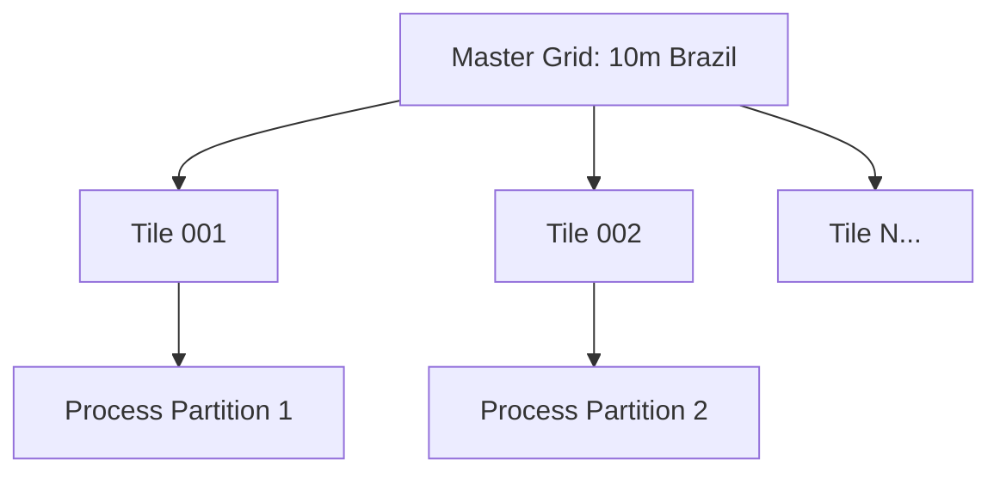

# Master Grids & Tiling

To process continental-scale data without massive memory requirements, DisSCube uses a "Virtual Tiling" approach.

## The Concept

Instead of creating thousands of individual small grids (which pollutes the catalog), we define a few **Master Grids** and use **Tiles** as execution filters.

## How it works in Code

When you call `cube.derive(derivation, tile_id="XYZ")`:

1. The system fetches the `GridSpec` for the Master Grid.
2. It fetches the `SpatialSource` for the specific tile to get its `BBOX`.
3. It creates a **Temporary Grid** that has the same resolution/CRS as the Master Grid but is restricted to the tile's BBOX.
4. The pipeline processes only this small window.
5. The output is saved in a tile-specific directory, preventing file collisions.

## Benefits
- **Memory Efficiency**: Process Brazil at 10m in 2GB of RAM by iterating tiles.
- **Parallelism**: Multiple workers can process different tiles of the same Master Grid simultaneously without race conditions (thanks to SQLite and unique paths).
- **Consistency**: All tiles are guaranteed to align perfectly because they all derive from the same Master Grid mathematical definition.
